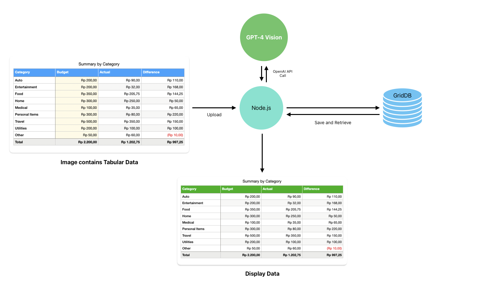

# Processing Image Data using GPT4-Vision, Node.js, and GridDB


This blog will explore how to use GPT-4 Vision to process image data, specifically tabular data from images, and store the results in GridDB. We will build a simple web application using React.js and Node.js that allows users to upload pictures and view the results of GPT-4V's image processing.

## Meet the Stacks

We will use Node.js, GridDB, and OpenAI's GPT-4 Vision. For the user interface, we will use React.js.

### GPT-4 Vision

GPT-4 with Vision, sometimes called GPT-4V, is one of the OpenAI's products. It allows the model to take in images and answer questions about them. Language model systems have historically been limited by taking in a single input modality, text. For many use cases, this constrained the areas where models like GPT-4 could be used. You can read more about GPT-4V in their official [documentation](https://platform.openai.com/docs/guides/vision).

### GridDB

GridDB is an open-source, in-memory NoSQL database optimized for IoT and big data applications. It is a highly scalable database that can handle large volumes of data with high throughput and low latency. GridDB is also ACID compliant and supports SQL-like queries. For more information about GridDB, please visit the [GridDB website](https://griddb.net/).

### Node.js

Node.js is an open-source, cross-platform JavaScript runtime environment that allows developers to build scalable network applications. It is built on top of Google's V8 JavaScript engine. It uses an event-driven, non-blocking I/O model that is lightweight and efficient. For more information about Node.js, please visit the [Node.js website](https://nodejs.org/en/).

### React.js

React.js is an open-source JavaScript library for building user interfaces. It is maintained by Facebook and a community of individual developers and companies. React.js allows developers to create reusable UI components that can be used across different applications. For more information about React.js, please visit the [React.js website](https://reactjs.org/).

## Prerequisites

This project is tested on Ubuntu 20.04.2 LTS WSL 2. To run this project, you need an OpenAI API key, GridDB, Node.js, and React.js. You can install them by following the instructions below.

### Install Node.js

To install Node.js v20 LTS on Ubuntu using the package manager, you need to add an additional `deb` repository. Please read and follow this [documentation](https://github.com/nodesource/distributions?tab=readme-ov-file#ubuntu-versions). After that, test if the Node.js is installed correctly by typing this command in the terminal:

```bash
node -v
```

### Install GridDB

The GridDB documentation for installation in Ubuntu on WSL can be found [here](https://docs.griddb.net/latest/gettingstarted/wsl/#installing-wsl). To check if GridDB is installed correctly, you can run the following command:

```bash
sudo systemctl status gridstore
```

If GridDB is not started, you can start it using this command:

```bash
sudo systemctl start gridstore
```

### OpenAI Account and API Key

You can get the OpenAI API key by signing up for an account at [OpenAI](https://platform.openai.com/api-keys/). To keep your API key safe, you can store it in a `.env` file in the project's root directory (more on this later).

## Running the Project

To get started, you must clone this [repository](https://github.com/junwatu/extract-image-table-gpt4-vision) and install the dependencies. You can do this by running the following commands:

```bash
git clone git@github.com:junwatu/extract-image-table-gpt4-vision.git
```

Change the directory to the project root `server` directory and install the dependencies:

```bash
cd extract-image-table-gpt4-vision/server
npm install
```

Create a `.env` file in the root directory of the project. The `.env` file should look like this:

```
OPENAI_API_KEY=<your-api-key>
```

And add `.env` to the `.gitignore` file to prevent it from being pushed to the repository.

Run the server:

```bash
npm start
```

In the browser, go to the default project URL: `http://localhost:5115` and try to upload an image that contains tabular data.

[//]: # (todo: create a gif to showcase the project)

## Project Architecture



The project follows a standard web application architecture. When an image containing tabular data is uploaded, Node.js will call upon GPT-4 Vision from OpenAI to process the image. The processed data will then be saved in the GridDB database. Afterward, the saved data will be displayed on a web page using React.js.

## Understanding GPT4-Vision

The GPT4 Vision model is best at answering general questions about what is present in the images. For example, to describe an image, we can use a simple prompt:

```js
"What's in this image?"
```

And then use the prompt in GPT4-Vision API:

```js
import OpenAI from "openai";

const openai = new OpenAI();

async function getImageDescription() {
  const response = await openai.chat.completions.create({
    model: "gpt-4-vision-preview",
    messages: [
      {
        role: "user",
        content: [
          { type: "text", text: "What's in this image?" },
          {
            type: "image_url",
            image_url: {
              "url": "https://upload.wikimedia.org/wikipedia/commons/thumb/d/dd/Gfp-wisconsin-madison-the-nature-boardwalk.jpg/2560px-Gfp-wisconsin-madison-the-nature-boardwalk.jpg",
            },
          },
        ],
      },
    ],
  });
  console.log(response.choices[0]);
}
```

The GPT4 Vision model will process the image based on the prompt and will return the result for further processing.

For our project, we can design a prompt to only recognize the tabular data from the uploaded image. For example, we can use this prompt to extract tabular data from the image:

[//]: # (need a better prompt)

```
Recreate the table in the image.
```

Then, in the code, we can use the prompt to only extract the tabular data from the image:

```js
messages: [
      {
        role: "user",
        content: [
            { type: "text", text: "Recreate table in the image." },
            { type: "image_url", 
              image_url: {
                "url": sampleImageAddress,
              },
            },
        ],
    },
],
```

[//]: # (Advantages of using GPT4-Vision for image processing)

## Integrating GPT4-Vision with Node.js

We can use Node.js and Express.js to build a simple web server and then create an image processing route that calls GPT4-Vision API after the image is finished and uploaded. 

For example, the `process-image` route will accept the uploaded image and then will call the `processImageRequest` function to process the image using OpenAI API:

```js
app.post('/process-image', upload.single('image'), async (req, res) => {
    try {
        const result = await processImageRequest(req.file.path);
        // save the result into the database
        res.json(result);
    } catch (error) {
        res.status(500).send('Error processing image request');
    }
});
```

The `processImageRequest` function is essentially a GPT4 Vision API wrapper function. The code will call the API and then process the image based on the designed prompt earlier:

```js
async function processImageRequest(filePath) {
    const response = await openai.chat.completions.create({
        model: "gpt-4-vision-preview",
        messages: [
            {
                role: "user",
                content: [
                    { type: "text", text: "Recreate table in the image." },
                    { type: "image_file", image_file: { "path": filePath } },
                ],
            },
        ],
        max_tokens: 1024,
    });
    return response.choices[0];
}
```

## Storing Processed Data in GridDB

- Overview of GridDB and its features
- Creating a schema for image data in GridDB
- Storing and retrieving image data with GridDB

## Building an End-to-End Application

- Designing the application workflow
- Integrating Node.js, GPT4-Vision, and GridDB
- Handling user inputs and displaying processed data

## References

- List of sources and further reading materials
